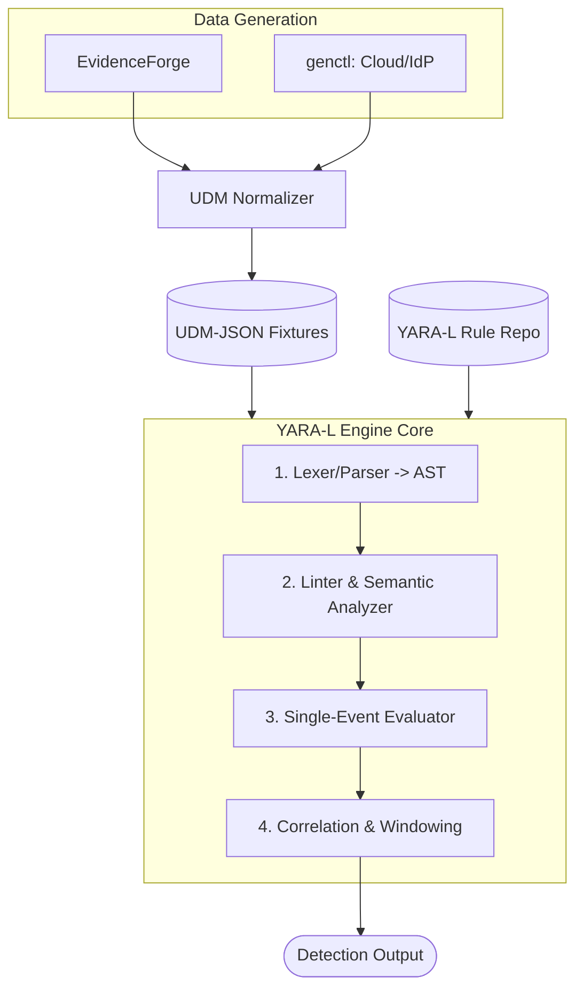

## The Problem

Detection engineering CI/CD for Google SecOps is broken. Not "needs polish" broken — structurally broken.

Every other engineering discipline treats "run the code locally before you ship it" as table stakes. You write a function, you have a unit test that exercises it in isolation, on your laptop, in milliseconds, with deterministic inputs. YARA-L 2.0 has no equivalent. There is no local execution engine. If you want to know whether a rule fires against a given sequence of events, your only option is the production tenant.

That means to test one windowed correlation rule you need:

- **A live tenant.** No tenant, no test. You cannot run YARA-L against a JSON file on disk.
- **Live API quotas.** Every iteration burns against ingestion and rule-management limits. Your test loop is rate-limited by someone else's billing model.
- **Real latency.** You push events, you wait for ingestion, you wait for the detection engine to schedule your rule, you wait for the match window to close. A single edge-case iteration on a `match` window with an `over` clause can be a multi-minute round trip. Multiply that by the number of times you actually get a correlation rule right on the first try. (Zero. The answer is zero.)

So the "test loop" for a detection engineer is: edit rule, upload rule, generate or replay telemetry, wait, poll for detections, read tea leaves, repeat. This is the developer experience of mainframe batch jobs in 1975, except you're also paying per submission and you can't step through anything.

You cannot build a real CI pipeline on top of this. You cannot run a rule regression suite on every pull request. You cannot bisect which commit broke a detection. You cannot fuzz your own rule logic. The entire modern toolchain — fast feedback, deterministic fixtures, hermetic tests — is unavailable because the language has no engine you're allowed to run.

Google has been asked, repeatedly and publicly, for a local validator or a free tier suitable for rule development. The answer is silence. Fine.

## The Solution: Correlant

**Correlant** is an independent, open-source implementation of the YARA-L 2.0 detection language, written in Go.

It is not a wrapper around a Google API. It does not phone home. It is a **local, bounded-memory stream processor** that takes UDM-JSON events on one side and YARA-L rules on the other, and tells you what fires — on your laptop, offline, in milliseconds, deterministically.

The design goals, in priority order:

1. **Local and hermetic.** A rule test is a Go test. Input is a fixture file. Output is a set of detections. No network, no tenant, no quota.
2. **Bounded memory.** It's a stream processor, not a batch loader. State for windowed correlation is keyed and evicted on watermark advance, so you can replay a large fixture without the resident set climbing to match the corpus. Memory is a function of the active window and key cardinality, not of total events seen.
3. **Specification-faithful, not implementation-faithful.** Correlant targets the *documented* YARA-L 2.0 semantics. Where Google's production engine does undocumented things, Correlant does the documented thing and writes down the difference (more on this below).

The point is to make the inner loop of detection engineering feel like the inner loop of literally any other software: write, test locally, commit, let CI run the suite. Correlant is the missing engine that makes that loop possible.

## The Architecture

The pipeline has three stages: generate telemetry, normalize it to UDM, execute rules against it.

### Data Generation

Deterministic telemetry in, deterministic detections out. If your fixtures are non-deterministic, your regression suite is a coin flip, so generation is a first-class concern.

- **Cisco Talos EvidenceForge** produces realistic raw endpoint and host telemetry for scenario-based fixtures.
- **`genctl`** is a set of custom generators for the sources EvidenceForge doesn't cover well — cloud control-plane logs and IdP/authentication events. `genctl` emits raw provider-shaped records (the same shape you'd get out of a real audit log), seeded so the same invocation always yields byte-identical output.

Both feed raw telemetry, not UDM. That's deliberate — the normalizer is part of what we want to test.

### Normalization

A Go-based **UDM Normalizer** translates raw provider telemetry into UDM-JSON. This is the same mapping problem you have in production (parser/field-mapping), so keeping it in the pipeline means fixture generation exercises the mapping, not just the rule logic. Output is line-delimited UDM-JSON that the engine consumes directly.

### The Engine Core

The engine is a four-stage pipeline. Each stage is independently testable, which matters because "the rule didn't fire" has very different causes at each stage.

1. **Lexer / Parser → AST.** A hand-written lexer and recursive-descent parser for YARA-L 2.0. No regex-based "parsing," no string munging — a real token stream and a real abstract syntax tree. This is what lets us give precise errors with positions instead of "rule failed to compile."
2. **Linter & Semantic Analyzer.** Walks the AST and checks the things the grammar can't: undefined placeholder variables, type mismatches in comparisons, `match` variables that aren't bound in the `events` section, `condition` referencing events that don't exist, aggregation functions used where scalars are required. This is your `go vet` for detections.
3. **Single-Event Evaluator.** Evaluates the `events` section predicates against one UDM event at a time. This is the stateless core: given an event and a set of filters, does it match, and what do the placeholder variables bind to? Everything windowed is built on top of this.
4. **Correlation & Windowing.** The stateful engine. It consumes the stream of per-event matches, groups by the `match` keys, and maintains keyed window state. Windows advance on **event-time watermarks** — not wall-clock — so replaying a fixture yields the same detections regardless of how fast you feed it. When a window's condition is satisfied, it emits a detection; when the watermark passes a window's horizon, its state is evicted. That eviction is what keeps memory bounded.

The full data flow:

Event-time watermarks and keyed state are the two ideas doing the heavy lifting. If you've built anything on Flink or Kafka Streams, this will look familiar — because a correlation rule *is* a windowed keyed join, and the correct way to execute one locally is the same as the correct way to execute one at scale, minus the distribution.

## The Boundaries (Reality Check)

I want to be extremely precise about what this is and is not, because "I built a YARA-L engine" invites the reasonable objection "no you didn't, you built a thing that behaves like YARA-L on the inputs you tried." Correct. Here is the honest scope:

> **Limitations & Reality Check:** This project is an independent, lab-only execution engine for the YARA-L 2.0 specification. It successfully validates syntax against the public `chronicle/detection-rules` repository and executes windowed joins based on publicly documented language semantics. It does not—and cannot—replicate Google SecOps production behaviors. Divergences such as repeated-field unnesting mechanisms, detection deduplication, maximum sample-event limits, entity-graph enrichment dependencies, ingestion latency scaling, and retrohunt parallelization are strictly out of scope. Undocumented engine behaviors are cataloged in `DIVERGENCES.md`.

Read that twice before you use this for anything. Correlant is a development and CI tool. It tells you your rule is *syntactically valid and logically fires on the semantics Google published*. It does not certify that the rule will behave identically in a production tenant, because production does undocumented things and I refuse to pretend otherwise. Passing the Correlant suite is necessary, not sufficient. It moves the "this rule is obviously broken" class of failure from a multi-minute production round trip to a millisecond local test, and leaves the "this rule interacts with an undocumented production behavior" class where it always was — in the tenant.

## Conclusion

That's the overview. The interesting engineering is in the parts, and the part I want to start with is the one most people get wrong: parsing.

The next post covers how to build a custom **lexer and AST in Go** to parse the YARA-L language *without relying on regex*. YARA-L has nested sections, placeholder variables, boolean expression trees, and aggregation semantics — none of which survive contact with a regex. I'll walk through the token design, the recursive-descent parser, and why a hand-written lexer buys you the error messages that make the whole local-testing workflow actually usable.
